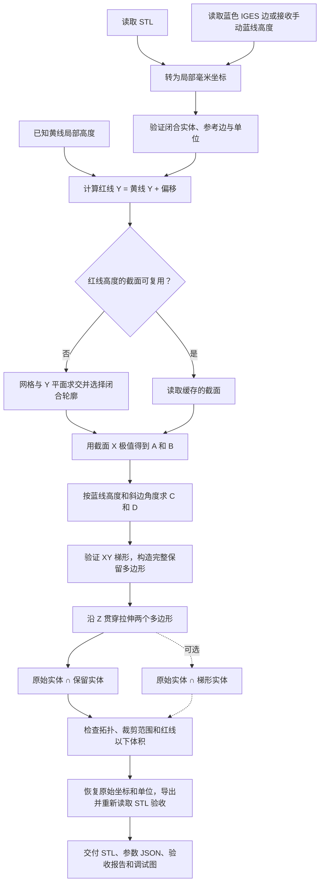

# 算法流程图

```mermaid
flowchart TD
    A["读取 STL"] --> T["转为局部毫米坐标"]
    B["读取蓝色 IGES 边或接收手动蓝线高度"] --> T
    Y["已知黄线局部高度"] --> R["计算红线 Y = 黄线 Y + 偏移"]
    T --> V["验证闭合实体、参考边与单位"]
    V --> R
    R --> S{"红线高度的截面可复用？"}
    S -- 否 --> I["网格与 Y 平面求交并选择闭合轮廓"]
    S -- 是 --> P["读取缓存的截面"]
    I --> AB["用截面 X 极值得到 A 和 B"]
    P --> AB
    AB --> CD["按蓝线高度和斜边角度求 C 和 D"]
    CD --> P2["验证 XY 梯形，构造完整保留多边形"]
    P2 --> Z["沿 Z 贯穿拉伸两个多边形"]
    Z --> F["原始实体 ∩ 保留实体"]
    Z -. 可选 .-> O["原始实体 ∩ 梯形实体"]
    F --> C["检查拓扑、裁剪范围和红线以下体积"]
    O -.-> C
    C --> E["恢复原始坐标和单位，导出并重新读取 STL 验收"]
    E --> G["交付 STL、参数 JSON、验收报告和调试图"]
```
